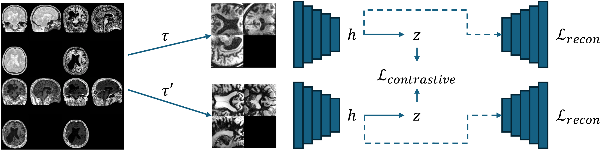

<div align="center">

# Unified 3D MRI Representations via Sequence-Invariant Contrastive Learning

[](https://arxiv.org/abs/2501.12057v2)
[](src/data_demo.ipynb)
[](https://huggingface.co/collections/liamchalcroft/midl-2025-678ccdb0162e0dc0a8b40960)

</div>

## Links

| Resource | Link |
|----------|------|
| 📄 Paper | [arXiv:2501.12057](https://arxiv.org/abs/2501.12057v2) |
| 🎮 Demo | [Data Augmentation Demo](src/data_demo.ipynb) |
| 🤗 Models | [Download weights](https://huggingface.co/collections/liamchalcroft/midl-2025-678ccdb0162e0dc0a8b40960) |

---

This repository contains the official implementation of **[Unified 3D MRI Representations via Sequence-Invariant Contrastive Learning](https://arxiv.org/abs/2501.12057v2)**. Our method learns robust, sequence-agnostic representations from multi-site, multi-sequence MRI data using self-supervised learning, enabling improved performance on downstream tasks like segmentation and denoising.

## Quick Start

Explore our data augmentation pipeline in the [Data Demo Notebook](src/data_demo.ipynb), which visualizes:
- Standard geometric/intensity augmentations
- Sequence simulation via Bloch equations
- Paired multi-contrast views

<div align="center">

</div>

## Cite this Work

```bibtex
@article{chalcroft2025unified,
  title={Unified 3D MRI Representations via Sequence-Invariant Contrastive Learning},
  author={Chalcroft, Liam and Crinion, Jenny and Price, Cathy J and Ashburner, John},
  journal={arXiv preprint arXiv:2501.12057},
  year={2025}
}
```

DOI: [10.48550/arXiv.2501.12057](https://doi.org/10.48550/arXiv.2501.12057)
